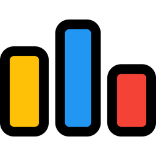

<H1 style="text-align:center; font-weight:bold;"> Hello world! I'm KrazyNPC! </H1>

<H2> About me </H2>

<ul>

<li style="font-style:italic;"> <strong> A 17 year old boy studying informatics at the High School for Gifted Students, Hanoi National University of Education. </strong> </li>

 

<li> I like competitive programming. And I'm currently rated as  Pupil  on codeforces. </li>

 

<li> <strong> My goals : </strong> </li>

 

<ul>

<li> <strong> Competitive Programming : </strong> Trying hard to reach  Candidate Master (1900+ rating)  on Codeforces. </li>

<li> <strong> IELTS : </strong> Trying to get band 7.5 on first attempt. </li>

<li> <strong> JLPT : </strong> I want to get N1 someday. </li>

</ul>

 

<li> <strong> Hobbies : </strong> </li>

 

<ul>

<li> <strong> Mathematics and Informatics : </strong> I really like solving problems, even though I can't solve my own. </li>

<li> <strong> Music : </strong> I mainly listen to rock and rap music. And my favorite artists are <a href="https://www.mychemicalromance.com/">My Chemical Romance</a> and <a href="https://www.nfrealmusic.com/">NF</a>. </li>

<li> <strong> Manga : </strong> I love reading romance comedy manga, especially <a href="https://twitter.com/hujiume">Koume Fujichika</a>'s <a href="https://mangadex.org/title/6d6d9fda-5cd3-40ac-948b-776b1a1a0eb1?page=1">Suki na Ko ga Megane wo Wasureta</a> and <a href="https://twitter.com/TEIGI_3">Hazano Kazutake</a>'s <a href="https://mangadex.org/title/6cc85df7-e44b-4fa1-97f2-be04430cc570/the-fairytale-like-you-goes-on-the-assault">Hakanai Kimi wa Moukou wo Hajimeru</a>. </li>

</ul>

</ul>

<H2> Contacts </H2>

<H2> My Github stats </H2>

